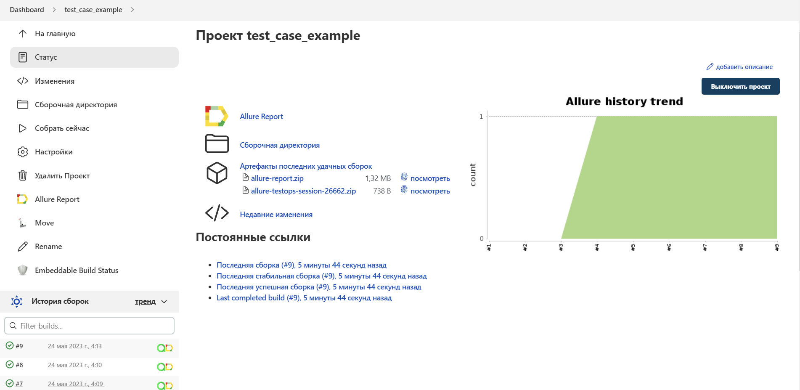
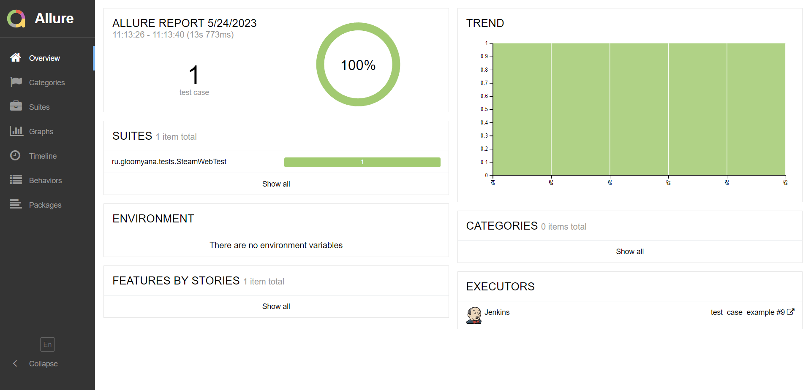
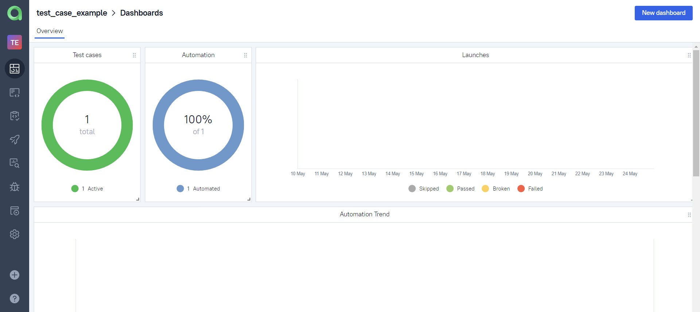
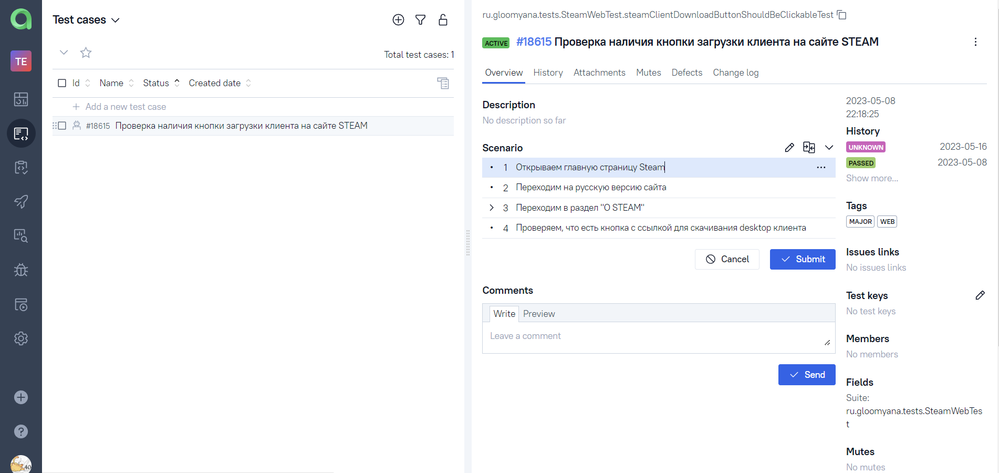
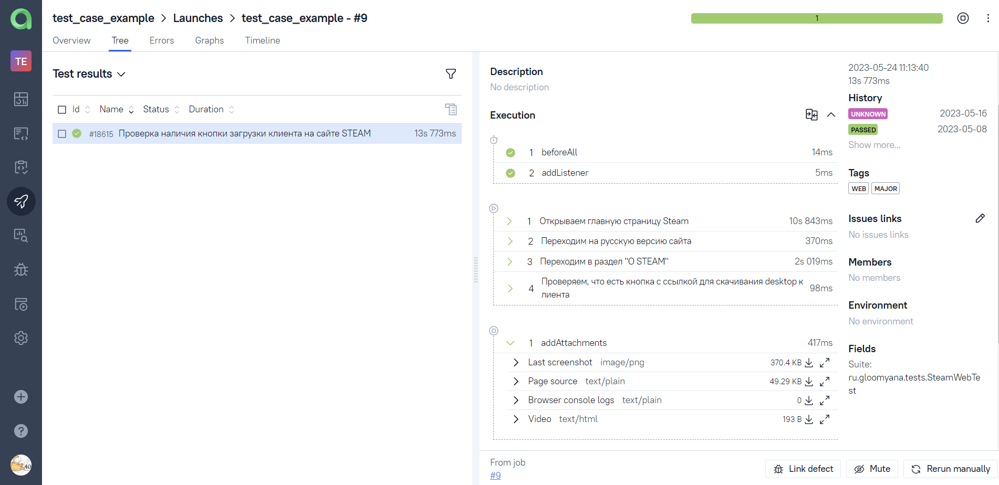

## Пример написания тест кейса через [Allure TestOps](https://allure.autotests.cloud/)

- [x] Запуск теста в `Jenkins`
- [x] Отчет `Allure Report`
- [x] Интеграция с `Allure TestOps`
- [x] Пример прогона теста в Selenoid

## :paperclip: Технологии и инструменты

 

[Cборка в Jenkins](https://jenkins.autotests.cloud/job/test_case_example/) 

[Allure Report](https://jenkins.autotests.cloud/job/test_case_example/9/allure/) 

[Allure TestOps Dashboard](https://allure.autotests.cloud/project/2255/dashboards) 

